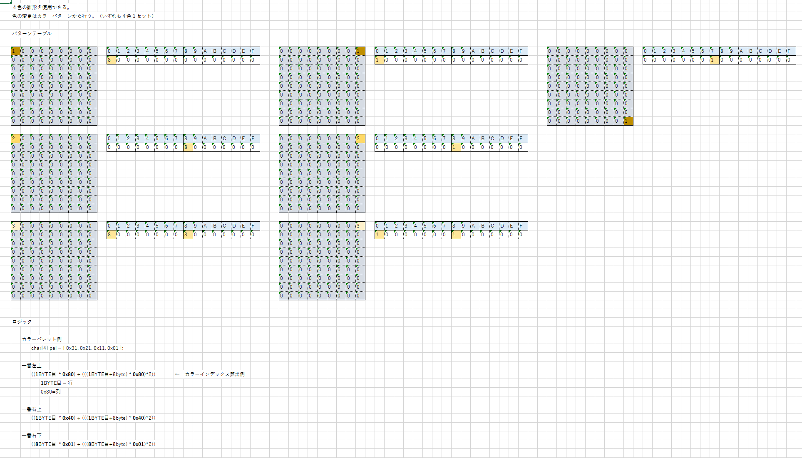

#キャラクタパターン




##ロジック

カラーパレット例<br>
```c
char[4] pal = { 0x31, 0x21, 0x11, 0x01 };

一番左上<br>
	((1BYTE目  * 0x80) + (((1BYTE目+8byte) * 0x80)*2))
	1BYTE目 = 行
	0x80=列

一番右上<br>
	((1BYTE目  * 0x01) + (((1BYTE目+8byte) * 0x01)*2))

一番右下<br>
	((8BYTE目  * 0x01) + (((8BYTE目+8byte) * 0x01)*2))
